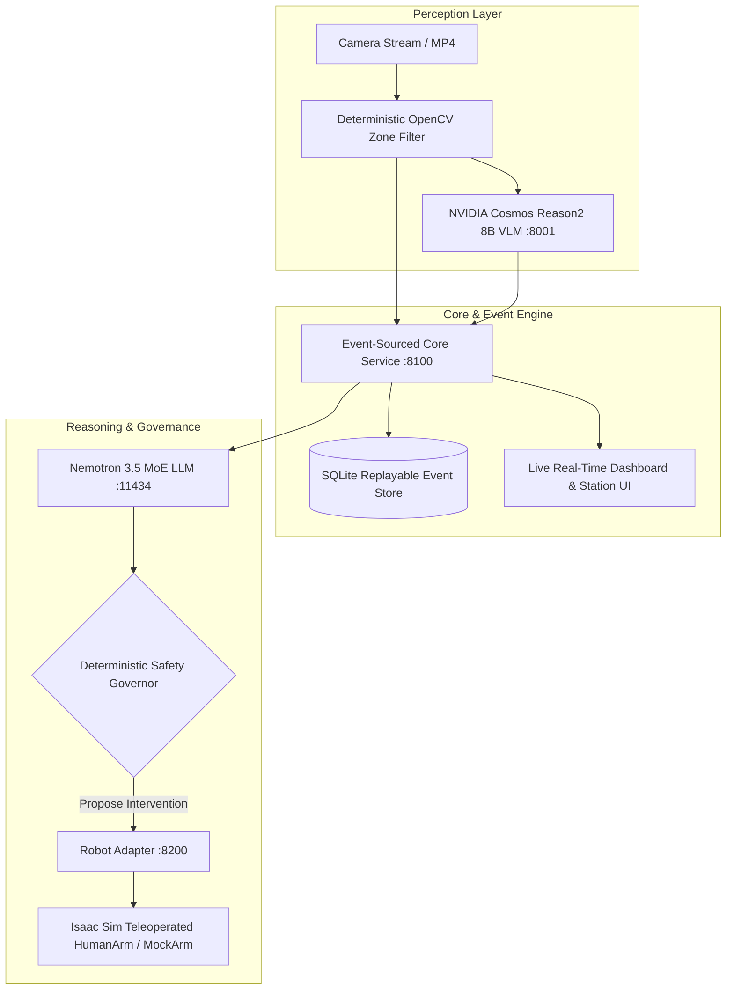

# 🏭 FactoryFlow AI / ForgeMind — Local Process Intelligence on NVIDIA DGX Spark

<p align="center">
  <strong>See the error. Recover the product. Improve the process.</strong><br>
  Local process intelligence, computer vision perception, and governed root-cause recovery for miniature assembly lines.
</p>

<p align="center">
  <a href="#license"></a>
  <a href="https://www.nvidia.com"></a>
  <a href="https://fastapi.tiangolo.com"></a>
  <a href="https://opencv.org"></a>
  <a href="https://developer.nvidia.com/isaac-sim"></a>
</p>

---

## 📌 Overview

**FactoryFlow AI / ForgeMind** is an edge-deployed industrial intelligence system built for the **NVIDIA Spark Hack Seattle**. It leverages event-sourced services and multimodal perception to reconstruct operational dependencies across a multi-stage assembly line.

It solves a critical manufacturing challenge: **distinguishing where a backlog becomes visible from where its root cause originated**. When an upstream defect occurs (e.g. Station A supplies an incomplete kit), the system diagnoses the origin, halts dependent propagation, requests a governed robotic intervention, and verifies recovery before releasing the line.

---

## 🏗️ System Architecture



---

## ✨ Key Capabilities

- **👁️ Multimodal Perception:** Deterministic OpenCV HSV zone counting paired with **NVIDIA Cosmos Reason2 8B** via local vLLM for second-opinion image/video defect verification.
- **🧠 Root-Cause Causality Engine:** Distinguishes observed bottlenecks from true upstream origins (e.g., Station A missing wheel $\rightarrow$ Station B backlog $\rightarrow$ Station C dependency idle).
- **🛡️ Deterministic Safety Governor:** Sits strictly between model proposals and actuation. The AI never receives raw joint-control or unverified motor authority.
- **🤖 Governed Teleoperation (`IsaacHumanArm`):** Dispatches recovery requests to an operator console where humans teleoperate robotic arms inside **NVIDIA Isaac Sim**.
- **📊 Code-Verified Metrics:** Replay-derived throughput, defect escapes, recovery time, cycle times, and queue latency computed directly from the event log.
- **🔬 Benchmarked Dataset:** Analyzed and validated against 10,000 rows of the UCI AI4I Predictive Maintenance dataset.

---

## 🚀 Quick Start on NVIDIA DGX Spark

### Prerequisites
- Python 3.10+
- NVIDIA GPU with vLLM / Ollama support

### Installation & Execution

```bash
# Clone the repository
git clone https://github.com/MadanMohan0537/ForgeMind.git
cd ForgeMind

# Set up virtual environment
python3 -m venv .venv
source .venv/bin/activate # Windows: .venv\Scripts\activate
pip install -r requirements.txt

# Launch MediaMTX and DGX Services
bash scripts/start_mediamtx.sh &
MODEL_RUNTIME=ollama ROBOT_ADAPTER=human REQUIRE_VLM=0 bash scripts/start_dgx.sh
```

### Synthetic Rehearsal (No Camera Required)

```bash
python scripts/synthetic_run.py --mode baseline --kits 8 --fast
python scripts/synthetic_run.py --mode recovery --kits 8 --fast
python scripts/synthetic_run.py --mode improved --kits 8 --fast
python -m pytest -q
```

---

## 🌐 Endpoints & Dashboards

- **Live Operator Dashboard:** `http://localhost:8100/dashboard`
- **FactoryFlow Scenario:** `http://localhost:8100/factoryflow`
- **Isaac Sim Operator Console:** `http://localhost:8100/operator`
- **Perception Calibration:** `http://localhost:8150/calibrate`

---

## 📄 Documentation

- [Demo Script](docs/DEMO_SCRIPT.md)
- [DGX Build & Validation Runbook](docs/DGX_RUNBOOK.md)
- [Physical Rig & Rehearsal](docs/PHYSICAL_RIG.md)
- [Core API & Operations](docs/CORE.md)
- [Nemotron 3.5 MoE Setup](docs/LIGHTNING_DSPARK.md)

---

## 📄 License

MIT License — see [LICENSE](LICENSE) for details.
